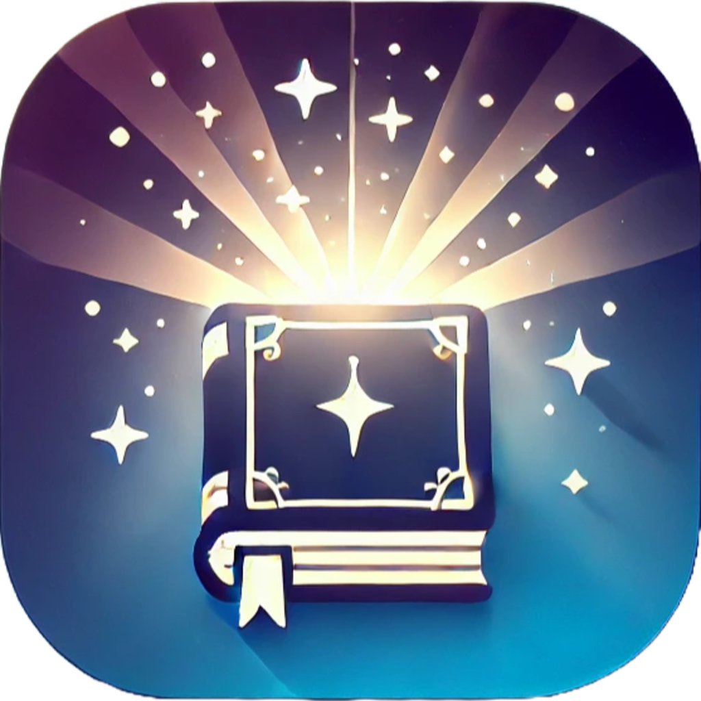

🦄 AI 창작동화: 꿈꾸는 이야기에 오신 것을 환영합니다 🦄
====================
 

📝 꿈꾸는 이야기란? 📝
---------------------

  
  
  <h3>만 4~6세의 미취학 아동을 위한  생성형 AI 기반 창작동화 애플리케이션</h3>
  
  

    버튼식 프롬프트 구조를 사용해 글을 모르는 아이들도  
    직접 원하는 동화를 창작할 수 있어요!  
    또한 보호자가 원하는 교훈(ex. 양치질 잘하기 등)을  
    동화 속에 자연스럽게 녹여낼 수 있답니다.
  

 

👬👨🏻‍💻 전래좋군 소개 👨🏻‍💻👬
---------------------
| **Members** | **Roles** | **Responsibilities** |
|:--|:--|:--|
| 조정민([@SeongJae999](https://github.com/SeongJae999))  skanehfud279@gmail.com | Team Leader, Back-end Engineer | - 서버 및 데이터베이스 관리   - Google Cloud Platform(GCP) 운영 |
| 김민규([@incheonQ](https://github.com/incheonQ))  logisdatascience@gmail.com | Front-end Developer | - UI/UX 설계 및 구현   - 버그 수정 및 디버깅 |
| 이동수([@Lee-Dongsu](https://github.com/Lee-Dongsu))  ehdtnehdtn95@naver.com | AI, NLP, Prompt Engineer | - 프롬프트 설계 및 AI 모델 실험   - QA, 사용자 및 모바일 서비스 테스트 |
| 김우찬([@chanxxw](https://github.com/chanxxw))  strauss2327@gmail.com | Project Manager, Prompt Engineer | - 전략 기획, 리서치 및 마케팅   - 이미지 프롬프트 엔지니어링 |

 

🤖 서비스 소개 🤖
---------------------
1. **꿈꾸는 이야기 개요**  
   - 만 4~6세 미취학 아동에게 특화된 생성형 AI 기반 창작동화 앱입니다.  
   - 텍스트·이미지·TTS(음성) 서비스가 하나로 결합되어, 버튼 클릭만으로 동화를 만들 수 있어요.  
   - 전래동화를 무료로 제공하고, ‘나만의 동화 만들기’는 구독 시스템을 통해 이용 가능합니다.  

2. **기본 기능**  
   - **나만의 동화 만들기**: 버튼식 프롬프트로 키워드를 선택하면, 해당 키워드를 바탕으로 텍스트·이미지·TTS가 자동 생성됩니다.  
   - **최근 동화**: 이전에 만들었던 ‘나만의 동화’를 다시 불러와 감상할 수 있습니다.  
   - **무료 동화**: 고전 전래동화를 ‘꿈꾸는 이야기’ 형식에 맞춰 이미지·TTS와 함께 제공합니다.  
   - **로그인 화면**: Google API 연동 및 자체 회원가입으로 아이디·비밀번호 로그인, 비밀번호 찾기 기능을 지원합니다.  

3. **부가 기능**  
   - **온보딩**: 처음 사용하는 유저를 위한 앱 사용 방법 안내.  
   - **기타 화면**  
     - **구독 및 결제**: 월간/연간 구독(추후 도입 예정)  
     - **설정**  
       - 계정 관리(비밀번호 변경, 계정 삭제 등)  
       - 앱 정보(이용 약관, 개인정보 처리 방침, 알림 설정)  
       - 도움말 및 지원(FAQ, 고객지원)  

4. **꿈꾸는 이야기의 특장점**  
   - 정보 접근 취약계층도 스마트폰만 있다면 쉽게 동화를 만들 수 있어요.  
   - 글을 모르는 미취학 아동도 버튼만 눌러 원하는 동화를 창작할 수 있습니다.  
   - 보호자가 원하는 교훈을 스토리에 녹여, 아이들이 재미있게 사회 규칙을 배울 수 있도록 돕습니다.  

> **자세한 내용은 3월에 공개될 유튜브 영상에서 확인하실 수 있습니다!**  

 

🗺️ 프로세스 맵 🗺️
---------------------
사용자가 앱을 사용하면서 거치는 단계 (User Flow)
예를 들어:
온보딩 → 2. 버튼 선택 → 3. 동화 생성 → 4. 이미지 생성 → 5. 오디오 변환
추천 이미지: 서비스 흐름을 보여주는 다이어그램

화면 캡쳐본으로 PPT로 만들어볼까?

 

Tech Stack
---------------------
### 🏗️ Core Technologies
- **Fairy Tale Text Generation:** Claude 3.5 Sonnet  
- **Image Generation:**  
  - GPT-4o-mini (프롬프트 텍스트 생성)  
  - FLUX.1-Schnell (이미지 생성 모델)  
- **TTS (Text-to-Speech):** Google Cloud Speech API 2.0  

### 📱 Frontend
- **Flutter** – 모바일 UI 개발  
- **Cursor.ai** – 개발 도구  

### 🖥️ Backend & Infrastructure
- **FastAPI** – API 서버  
- **Firebase** – 데이터 관리  
- **Google Cloud Platform(GCP)** – 클라우드 서비스  
- **Ngrok** – 터널링 서비스  

### 🧠 AI & Model Training
- **LangChain** – AI 모델 연결  
- **LoRA (Low-Rank Adaptation)** – 이미지 경량 모델 튜닝  
- **ComfyUI** – Text-to-Image 모델용 노드 기반 GUI  

 

 
🏛️ Architecture 🏛️
---------------------
- 전체 시스템이 어떤 방식으로 동작하는지를 다이어그램으로 설명하는 섹션입니다.  
- 사용자가 요청 → AI 모델 → 데이터 처리 → 최종 결과 출력 흐름을 설명

이걸로 올려도 되는건지?

 

📚 시연 영상 및 발표자료 📚
---------------------
- gif로 올리기
1. 나만의 동화 만들기
2. 무료 동화
3. 아이펠톤 발표영상(발표영상은 3월 중 업데이트 예정)

 

🌲 Project Tree 🎄
---------------------
- 프로젝트 폴더 구조 정리
  - flutter dict
    |-- component
    |   |-- audioplayer.dart
    |   |-- auth_service.dart
    |   |-- firebase_options.dart
    |   |-- keyword.dart
    |   |-- story.dart
    |   `-- user.dart
    |-- main.dart
    |-- pages
    |   |-- account
    |   |   |-- forgot_password.dart
    |   |   |-- login.dart
    |   |   `-- register.dart
    |   |-- drawer
    |   |   |-- setting
    |   |   |   |-- account.dart
    |   |   |   |-- help.dart
    |   |   |   |-- privacy.dart
    |   |   |   |-- terms.dart
    |   |   |   `-- widget.dart
    |   |   |-- setting.dart
    |   |   |-- sharing.dart
    |   |   `-- subscribe1.dart
    |   |-- friend_bookshelf.dart
    |   |-- home.dart
    |   |-- onboarding.dart
    |   `-- story
    |       |-- feedback.dart
    |       |-- recnet_story.dart
    |       |-- story_display_page.dart
    |       |-- story_generate.dart
    |       `-- story_selection.dart
    |-- test.txt
    `-- utils
        `-- login_text.dart

  - server dict
    |-- app_logs.log
    |-- demo_service_account.json
    |-- dreamingstory-63139-firebase-adminsdk-gnmm4-d61eb7678f.json
    |-- main.py
    |-- models
    |   |-- story.py
    |   `-- user.py
    |-- output
    |   |-- 1MG9Qkc7BFSf7SR0QXYPLW63KEH2
    |   |   `-- story_1738832935
    |   |       |-- audios
    |   |       |   |-- first_1738833037.mp3
    |   |       |   |-- forth_1738833170.mp3
    |   |       |   |-- second_1738833082.mp3
    |   |       |   |-- third_1738833126.mp3
    |   |       |   |-- title_1738832994.mp3
    |   |       |   `-- wisdom_1738833213.mp3
    |   |       `-- images
    |   |           |-- images_00001_.png
    |   |           |-- images_00002_.png
    |   |           |-- images_00003_.png
    |   |           |-- images_00004_.png
    |   |           |-- images_00005_.png
    |   |           `-- images_00006_.png
    |   |-- freeStory001
    |   |   `-- \271\335\302\246\300\314\300\307 \300\314\273\241 \270\360\307\350
    |   |       |-- audios
    |   |       `-- images
    |   |-- freeStory002
    |   |   `-- Sun_and_moon
    |   |       |-- audios
    |   |       `-- images
    |   |-- freeStory003
    |   |   `-- brothers
    |   |       |-- audios
    |   |       `-- images
    |   `-- freeStory004
    |       `-- axes
    |           |-- audios
    |           `-- images
    |-- prompts
    |   |-- imgGen_prompt_v3.txt
    |   `-- textGen_prompt.txt
    |-- routes
    |   |-- auth_routes.py
    |   |-- generate_story_routes.py
    |   `-- story_routes.py
    `-- utils
        |-- __init__.py
        |-- auth.py
        |-- comfyui_utils.py
        |-- config.py
        |-- database.py
        |-- image.py
        |-- story.py
        `-- tts.py

 

🪪 License 🪪
---------------------
- 앱 사용 방식 설명
- API 기반 서비스라면 API 엔드포인트 정보 포함

1- 본 앱은 API를 통해 다양한 서비스를 제공하고 있습니다.  
- 서비스 이용 전 아래 라이선스 관련 정보를 꼭 확인해주세요.

1. **이미지 생성: FLUX**  
   - The FLUX.1 [dev] Model is licensed by Black Forest Labs. Inc. under the FLUX.1 [dev] Non-Commercial License. 
   - Copyright Black Forest Labs. Inc.  
   - IN NO EVENT SHALL BLACK FOREST LABS, INC. BE LIABLE FOR ANY CLAIM, DAMAGES OR OTHER LIABILITY, WHETHER IN AN ACTION OF CONTRACT, TORT OR OTHERWISE, ARISING FROM, OUT OF OR IN CONNECTION WITH USE OF THIS MODEL.

2. **배경 음악**: Created with Suno AI  
3. **아이콘**: [Icons8](https://icons8.com/)

> **해당 프로젝트를 활용하길 원하실 경우, 먼저 팀 리더(조정민, skanehfud279@gmail.com)에게 메일로 문의 부탁드립니다.**

Reference
---------------------
- PPT 정리 후 올리기

 

Acknowledgements
---------------------
이번 프로젝트를 성공적으로 진행할 수 있도록 도움을 주신 모든 분들께 감사드립니다.

- [**@전효정**](https://www.linkedin.com/in/%ED%9A%A8%EC%A0%95-%EC%A0%84-11b8b2179/) – AIFFELthon Project Manager 🏆  
- [**@조새벽**](https://www.linkedin.com/in/chochoq/) – Flutter Mentor 📱  
- [**@오근철**](https://www.linkedin.com/in/gchrisoh/) – Modeling Mentor 🤖  

여러분의 관심과 지원 덕분에 **전래좋군 팀**의 “꿈꾸는 이야기”가 탄생할 수 있었습니다. 정말 감사드립니다! 🙌

 

---
이 프로젝트는 [모두의연구소](https://modulabs.co.kr/) **아이펠 코어 9기** 과정에서 진행된 **아이펠톤**을 통해 기획·개발되었습니다.  
**전래좋군 팀**에서 기획과 구현을 맡아 개발하였습니다.  

   

> **문의 사항이나 협업 제안이 있으시다면 언제든 환영합니다.**  
> 팀 리더(조정민)에게 메일(**skanehfud279@gmail.com**)로 연락 부탁드립니다.

  

  Made with 💖 by 전래좋군 팀

